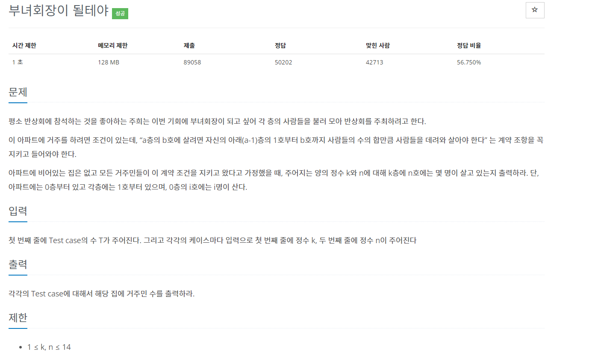

## 2775번 부녀회장




일반코드
```python
t = int(input())

zero_dict = {}
for i in range(1, 15):
    zero_dict[i] = i

print(zero_dict)
for _ in range(t):
    k = int(input())
    n = int(input())
```


숏코드
```python
import math
i=lambda:int(input())
exec('k,n=i(),i();print(math.comb(k+n,k+1));'*i())
```

```python
import math
for _ in range(int(input())):
    a=int(input())
    b=int(input())
    print(math.comb(a+b,a+1))
```

순환, 반복, 배열로도 풀이가 가능하나 math모듈의
조합comb로 했을때 가장 간결한 코드를 얻을 수 있다.
(수식의 규칙 파악이 중요)
