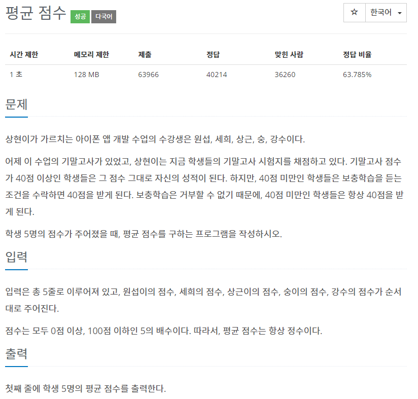

##eval()사용으로 단축

###백준10039번



일반적인 코드로 다음과 같이 풀이하였다.
lst리스트에 컴프리헨션으로 입력받아
lambda 함수르르 사용해 avg를 구했다.
```python
lst = [int(input()) for _ in range(5)]
lst = list(map(lambda x: x if x >= 40 else 40, lst))
avg = sum(lst) / len(lst)
print(int(avg))
```

eval()을 이용해 한 줄로 코드를 줄였다,
```python
print(eval("+max(8, int(input())//5)" * 5))
```
max()를 이용해 8(40이하일시의 평균)과 input의 평균중 큰값을 받아
avg를 구한다.